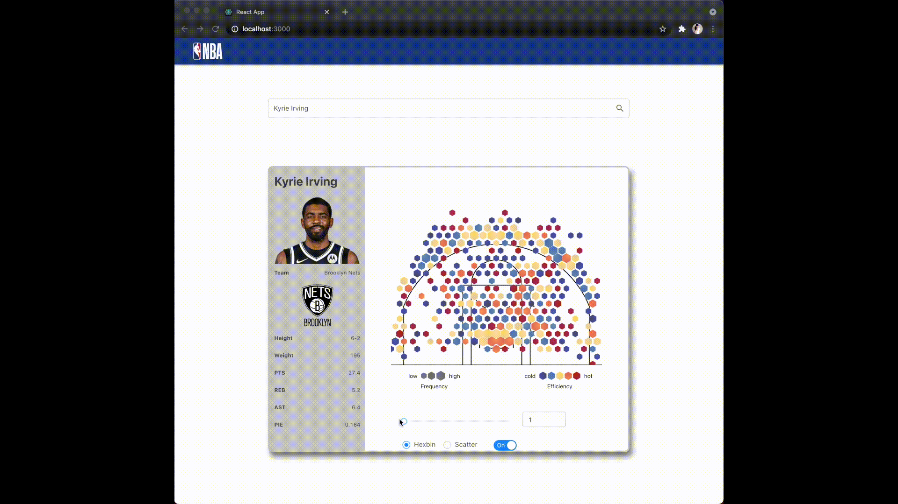
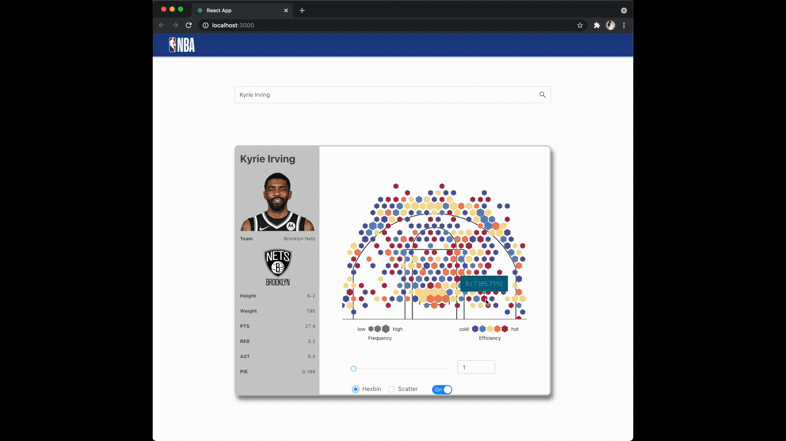
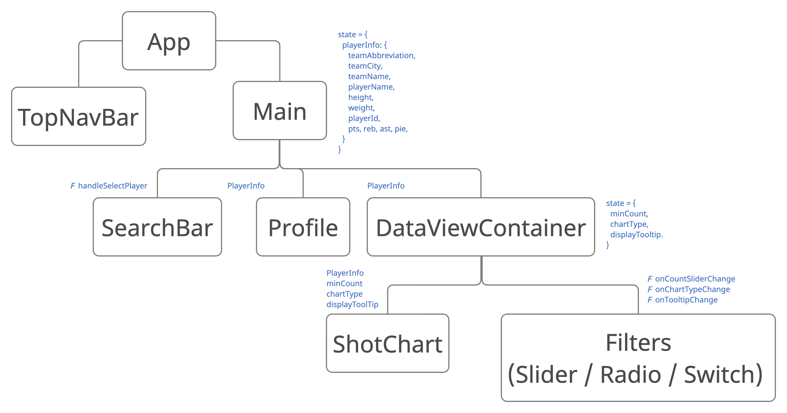

# TL;DR
This is a single page application written in React JS for visualizing NBA player stats. 
It implements four features:

- Search function to display stats of any current NBA player.
- Slider for setting the minimum number of shots to render.
- Changing Chart Type to display in Hexbin or Scatter. 
- Switching tooltip on and off. 

## Behind the scenes
### Dependencies 
- nba: Node.js client for nba.com API endpoints https://www.npmjs.com/package/nba
- d3-shotchart: plugin for easy visualization of basketball shotchart data https://www.npmjs.com/package/d3-shotchart/v/0.0.2
- antd: an enterprise-class UI design language and React UI library https://www.npmjs.com/package/antd

### Data Model and Components

## Test it!

This project was bootstrapped with [Create React App](https://github.com/facebook/create-react-app).
In the project directory, you can run:

### `npm start`

Runs the app in the development mode.\
Open [http://localhost:3000](http://localhost:3000) to view it in the browser.

### `npm test`

Launches the test runner in the interactive watch mode.\
See the section about [running tests](https://facebook.github.io/create-react-app/docs/running-tests) for more information.

